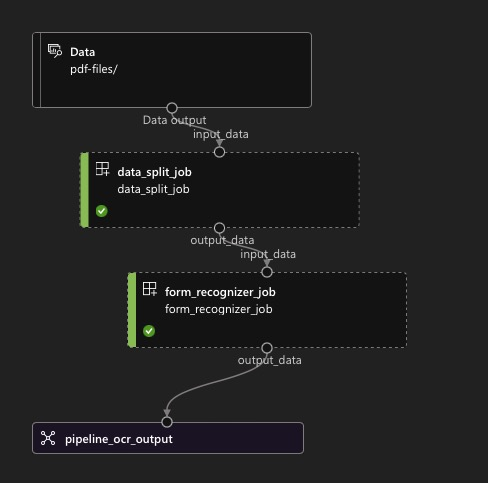

# ai-document-extraction-pipeline
This repo is inspired by the approach laid out by [Alexandre Delarue](https://github.com/aldelar) in his [aml-documents-extraction](https://github.com/aldelar/aml-documents-extraction) repo. This architectural approach leverages Azure
Machine Learning's pipeline infrastructure to orchestrate a flexible document enrichment pipeline. This repo follows a similar
approach. However, it seeks to demonstrate a more gradual approach to building a parallel pipeline, starting from a single job to
a sequential pipeline and then to a parallel pipeline. It also is updated for the use of the Azure ML Python SDK v2, which went
generally available in mid-2022.
  
A document enrichment pipeline typically has both an extraction and enrichment pattern. Both pipeline
workflows below demonstrate this in discrete steps. In both, the goal is to first break out the PDFs into pages (images), and then
process them individually to extract their text. Given PDFs have variable sizes, first splitting into pages can help normalize a
standard unit to process.

The key workflows are in three stages, which map to the folder structure:
- `single-step-job`. This is a demonstration of a single job that takes PDF files, and breaks it into discrete images.
- `pipeline-sequential`. This is a demonstration of a sequential pipeline which first takes PDF files, breaks
  it into images, and then leverages [Azure Form Recognizer](https://azure.microsoft.com/en-us/products/form-recognizer/) and a pre-built model to perform
  OCR recognition to pull out text. A visual illustration of this process is shown below.
  
  
  
- `pipeline-parallel`. This is a demonstration of the sequential pipeline, but each step is parallelized. This
  allows for horizontal scaling and faster processing. To understand more about parallel processing in
  Azure ML, refer this [documentation](https://learn.microsoft.com/en-us/azure/machine-learning/how-to-use-parallel-job-in-pipeline?tabs=cliv2).
  A visual illustration of this process is shown below.
  
  

### Notes on the initial setup
- To enable for easier file management, I recommend converting the blob store to an ADLS Gen 2 account. This can be done by
  following the instructions [here](https://learn.microsoft.com/en-us/azure/storage/blobs/upgrade-to-data-lake-storage-gen2-how-to?tabs=azure-cli). There are Azure portal instructions, but as part of the initial setup, this is done through the bash script. Evidence that this is
  completed successfully is evidenced by the Hierarchial namespace changing from `Disabled` to `Enabled`. Once done, this is non-reversible. Preferably, do this after
  creating the cluster and the environments in Azure ML.
- All steps are captured in the flow of the `Makefile`.

### Other considerations
- With PDF file names, ensure special characters like `+` don't cause issues while processing. This is not specifically handled in
  the above operations.
- Given the size of the PDF files being processed, this can sometimes lead to out of memory issues. Either change the compute
  configuration or have a way of filtering out larger items to process independently.
- As of the current update (May 2024), [azure-ai-form-recognizer](https://pypi.org/project/azure-ai-formrecognizer/) was version 3.1 and GA. Over time, however this will give way to
  [azure-ai-documentintelligence](https://pypi.org/project/azure-ai-documentintelligence/) which is currently version 4.0 and in preview. This repo uses the former.
- In terms of RBAC, both the Azure ML workspace and the service principal have `Contributor` access to the storage account.
  Additionally, the workspace has `Storage Blob Data Contributor` access to the storage account.
- Specific to the parallel pipeline approach:
  - This approach works whether you upload files or folders. During deletion, this requires first deleting the underlying files or folders before the parent.
  - The pipeline steps are: 1) delete all intermediate containers for prior run data, 2) break each PDF into a single page, grouped by folder for PDF 3) extract each PDF page for its raw text equivalent using Form Recognizer (Azure AI Document Intelligence) and 4) consolidate all the text files into one text file corresponding to the original PDF. It was considered whether after a run to delete the source pdf container, but this was omitted.

### Future State
- Having multiple Form Recognizer resources vs. a single one.
- No specific exception handling for the api calls to the Form Recognizer resource.
- Ideally, would want some automated trigger in place to trigger the pipeline based upon modification or adding a blob to the source container. Be sure to leverage Azure ML SDK v2 to do this through batch endpoints, and some kind of a trigger mechanism.
- Parallelize the first component around deleting intermediate files and the last component around consolidating text files.
- Some automated alert or email to identify when the batch is complete.
